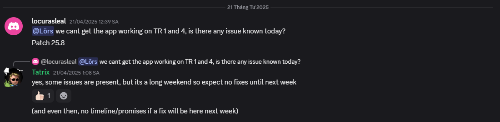

> A week to build something complex enough like a LoL HUD, that almost broke my mental hard

# An (unfinished) attempt of developing a custom LoL HUD, for Road to VCS Spring 2025.
This is supposed to be a custom developed HUD, made for [**Road to VCS Summer 2025**](https://www.youtube.com/watch?v=dtYYqZFpi28). Powered by [League Broadcast - Blue Bottle](https://bluebottle.gg), this allowed us to grab the in-game data directly, as there was no in-game API for the live data before.

As we have come to the later stages of the tournament, we were given access to the Tournament Realm patch 25.8, however, Blue Bottle was not able to grab the in-game data. Apparently, there's a bug with the 25.8 version, which caused the app to not read the game data.

Because of the above problems, this project is now suspended. The code will still be there for reference purposes, but changes may not be made anymore. 

## How to run this thing
1. Download and install Blue Bottle [here](https://bluebottle.gg/)

    a. If you are running this on a Live Game, be sure that you are running the game as spectator. ***DO NOT RUN THIS APP AS A PLAYER!*** Create your tournaments and match as prompted on the app.

    b. If you are just testing this, go to the `Style Editor` and enable the `In-Game 2D Overlay`, this will display the HUD with some sample data.

2. `git clone` this repository.
3. `cd testing-league-broadcast-hud`.
4. Do an `npm install` or `pnpm install` with your favorite Node package manager.
5. Go to `http://localhost:5173/graphics/ingame/`
6. Et voilà! The sample data should show on the page.

## What is not finished?

*A lot.* Way too many.
### Champ Select:
- [ ] Custom champ-select graphic, with the new Fearless Draft (https://wiki.leagueoflegends.com/en-us/Team_drafting#Fearless)

### Ingame
- [ ] The lower top bar, for the timers, the new [Feats of Strength](https://wiki.leagueoflegends.com/en-us/Feats_of_Strength) display, and Elemental Dragons.
- [ ] Atakhan/Baron/Elder Dragon Power Play
- [ ] An overlay to display the players who still have the Baron/Elder/Baron+Elder buff
- [ ] (optional) Bought items and leveling up animation
- [ ] (optional) Custom item tab (similar to most of the HUD in tier-1 tournaments), with gold differences